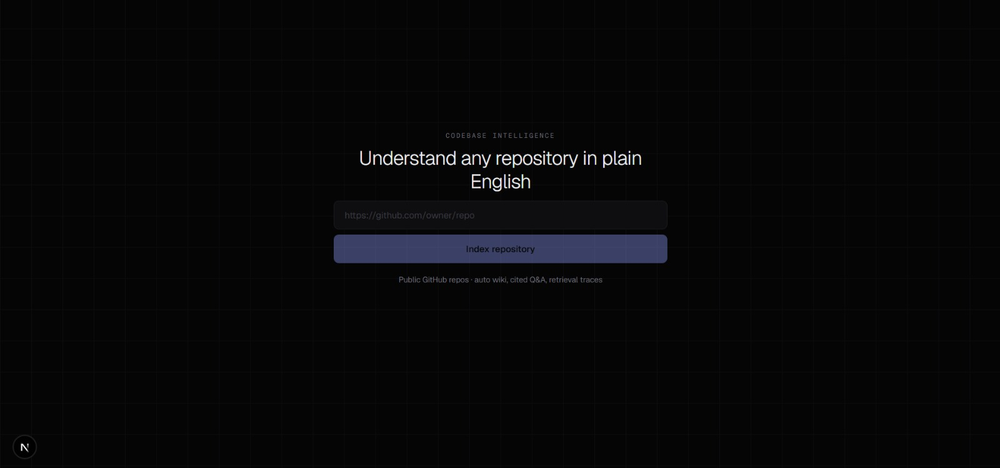
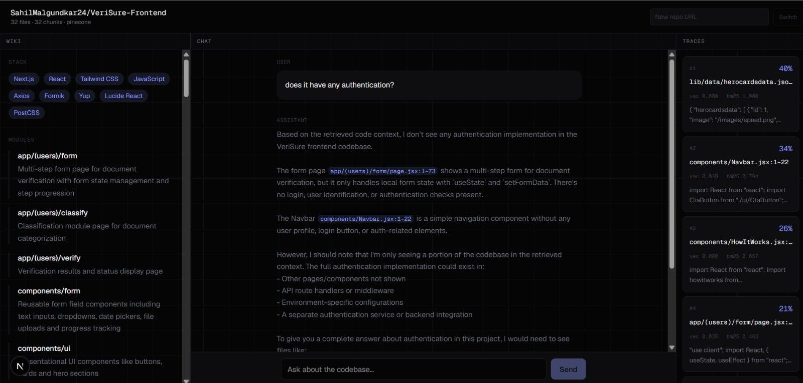
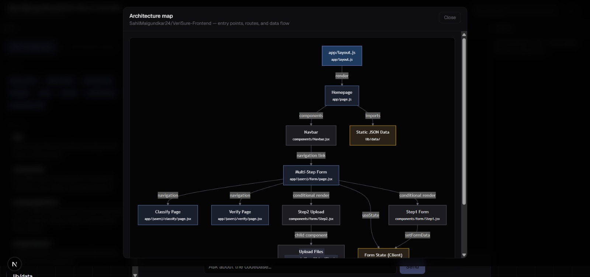

# Codebase Intelligence Platform

A Next.js app that indexes **public GitHub repositories** and helps you understand them with an auto-generated wiki, cited Q&A chat, hybrid retrieval traces, and lightweight dependency-impact analysis.

Paste a repo URL → index → explore **Wiki**, **Chat**, and **Traces** side by side.

## Demo screenshots

<p align="center">
  
</p>
<p align="center"><em>Landing page — paste a repo URL and index</em></p>

<p align="center">
  
</p>
<p align="center"><em>After ingest — Wiki (architecture), Chat (cited Q&amp;A), Traces (hybrid retrieval scores)</em></p>

<p align="center">
  
</p>
<p align="center"><em>Visual Representation</em></p>

## Features


| Feature               | Description                                                                                                                     |
| --------------------- | ------------------------------------------------------------------------------------------------------------------------------- |
| **Repo ingest**       | Paste `https://github.com/owner/repo` — downloads up to **500** source files, chunks code, embeds vectors, stores session state |
| **Auto wiki**         | Structured architecture (tech stack, modules, entry points, data flow) plus streaming markdown overview                         |
| **Cited chat**        | Ask questions; answers cite code as `[path/to/file.ts:42-58]` from retrieved chunks                                             |
| **Hybrid retrieval**  | **Vector search** + **BM25** fused (60% / 40%), top 8 chunks per question                                                       |
| **Retrieval traces**  | Per-chunk vector score, BM25 score, combined rank, and preview (updates after each chat)                                        |
| **Dependency impact** | Questions like *“what breaks if I change X?”* use a static **import graph** (high / medium / low risk)                          |
| **Session memory**    | Rolling conversation summary across chat turns                                                                                  |
| **Switch repo**       | Re-index another public repo from the header                                                                                    |


### UI

See [demo screenshots](#demo-screenshots) above.

- **Landing:** centered URL input (button below input)
- **After ingest:** three columns — **Wiki** | **Chat** | **Traces** (traces hidden below `md` breakpoint)

## Tech stack


| Layer      | Technology                                                                      |
| ---------- | ------------------------------------------------------------------------------- |
| Framework  | **Next.js 16** (App Router), **React 19**, **TypeScript 5**, **Tailwind CSS 4** |
| LLM        | **Vercel AI SDK** + **Anthropic Claude Haiku 4.5** (`claude-haiku-4-5`)         |
| Embeddings | **Local feature hashing** (no OpenAI) — `EmbeddingModelV3` via AI SDK           |
| Vectors    | **Pinecone** (optional) with **in-memory fallback**                             |
| GitHub     | REST API (repo + tree) + `raw.githubusercontent.com` + Contents API fallback    |
| Other      | **Zod** (wiki schema), custom **BM25**                                          |


## How it works

```text
POST /api/ingest
  → parse URL → fetch files (github.ts)
  → chunk by function/class (chunker.ts)
  → embedMany (local-embeddings.ts)
  → upsert Pinecone or in-memory (pinecone.ts)
  → build import graph (dependencies.ts)
  → createSession (in-memory Map)

POST /api/wiki (SSE)
  → structured architecture (generateText + Zod schema)
  → stream markdown overview

POST /api/chat (stream)
  → optional dependency impact from query text
  → hybridRetrieve → save traces on session
  → streamText with citations + conversation summary

GET /api/traces?sessionId=
  → last retrieval traces for the session
```

### Project layout


| Area         | Path                                                                                    |
| ------------ | --------------------------------------------------------------------------------------- |
| UI           | `src/components/` — `AppShell`, `IngestForm`, `WikiSidebar`, `ChatPanel`, `TracesPanel` |
| Ingest       | `src/lib/run-ingest.ts`, `src/app/api/ingest/route.ts`                                  |
| GitHub       | `src/lib/github.ts`                                                                     |
| Chunks       | `src/lib/chunker.ts`                                                                    |
| Retrieval    | `src/lib/retrieval.ts`, `src/lib/bm25.ts`, `src/lib/pinecone.ts`                        |
| Dependencies | `src/lib/dependencies.ts`                                                               |
| Sessions     | `src/lib/session.ts`                                                                    |
| AI           | `src/lib/ai.ts`, `src/lib/local-embeddings.ts`, `src/lib/schemas.ts`                    |
| Docs         | `docs/images/` — README screenshots                                                     |


## Getting started

### Prerequisites

- Node.js 20+
- [Anthropic API key](https://console.anthropic.com/)
- (Recommended) [GitHub personal access token](https://github.com/settings/tokens) for public repos — no scopes required
- (Optional) [Pinecone](https://www.pinecone.io/) index matching `PINECONE_DIMENSION`

### Install and run

```bash
npm install
cp .env.example .env.local
# Edit .env.local — at minimum set ANTHROPIC_API_KEY
npm run dev
```

Open [http://localhost:3000](http://localhost:3000), paste a **public** GitHub repo URL, and click **Index repository**.

### Environment variables


| Variable             | Required      | Purpose                                       |
| -------------------- | ------------- | --------------------------------------------- |
| `ANTHROPIC_API_KEY`  | Yes           | Claude for chat and wiki                      |
| `GITHUB_TOKEN`       | Recommended   | Higher GitHub rate limits (~5k/hr vs ~60/hr)  |
| `PINECONE_API_KEY`   | Optional      | Cloud vector storage                          |
| `PINECONE_INDEX`     | With Pinecone | Index name (e.g. `codebase-intelligence`)     |
| `PINECONE_DIMENSION` | With Pinecone | Must match index dimension (default `1024`)   |
| `SKIP_PINECONE`      | Optional      | Set to `true` to force in-memory vectors only |


Example `.env.local`:

```env
ANTHROPIC_API_KEY=sk-ant-...
GITHUB_TOKEN=ghp_...
PINECONE_API_KEY=...
PINECONE_INDEX=codebase-intelligence
PINECONE_DIMENSION=1024
```

### Pinecone setup (optional)

```bash
npm run pinecone:setup
```

If Pinecone is missing or unreachable, the app falls back to in-memory vectors automatically.

## Scripts


| Command                  | Description                     |
| ------------------------ | ------------------------------- |
| `npm run dev`            | Development server              |
| `npm run build`          | Production build                |
| `npm run start`          | Run production server           |
| `npm run lint`           | ESLint                          |
| `npm run pinecone:setup` | Create/configure Pinecone index |


## API routes


| Method | Path          | Description                           |
| ------ | ------------- | ------------------------------------- |
| `POST` | `/api/ingest` | Index a repository                    |
| `POST` | `/api/wiki`   | SSE wiki generation                   |
| `POST` | `/api/chat`   | Streaming chat (requires `sessionId`) |
| `GET`  | `/api/traces` | Retrieval traces for last chat query  |


## License

Private project — add a license if you open-source it.